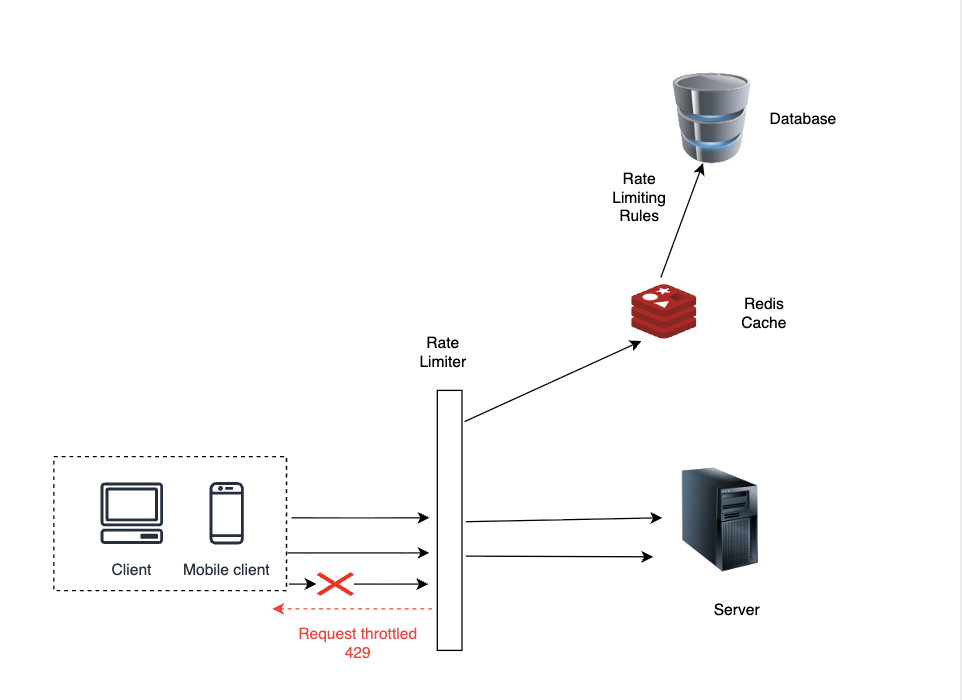
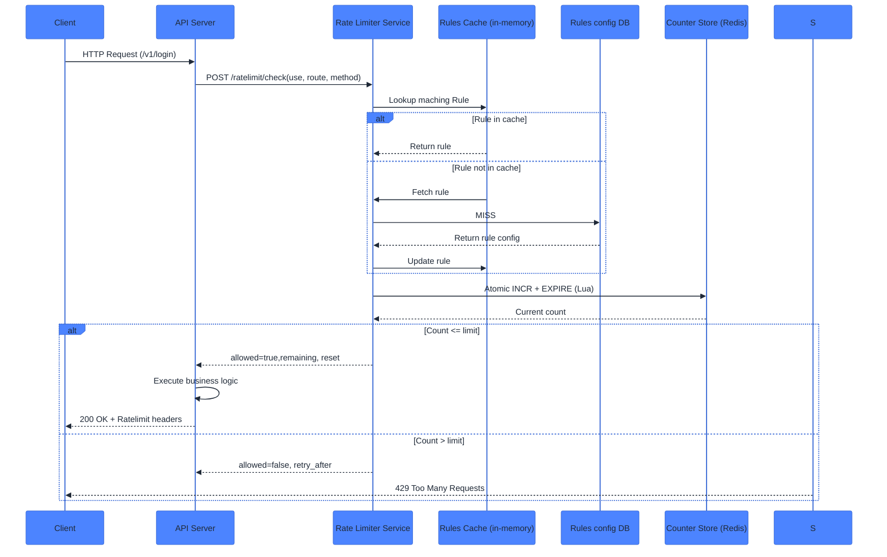
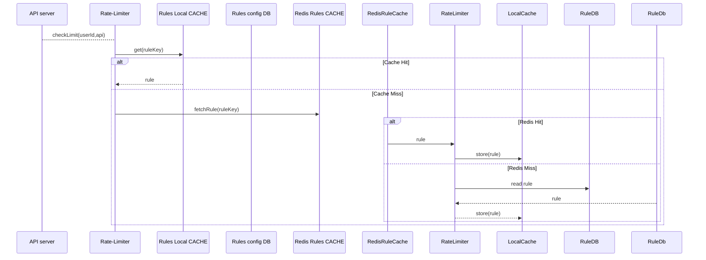
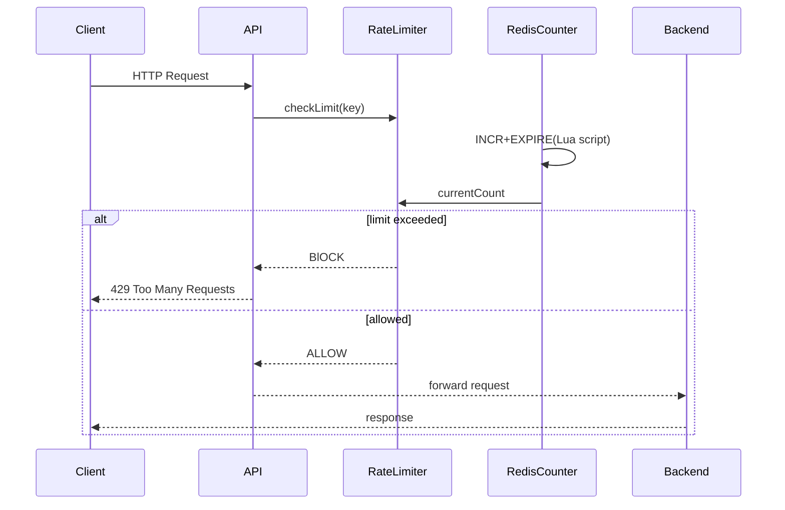
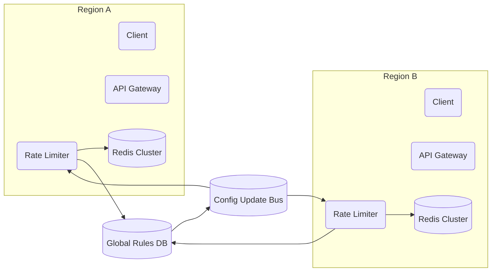

# Design a Rate Limiter
### Problem Statement:
 Build a system for limiting the number of requests a client can make to the server over a time period.
All the calls beyond the specified limit by the client would be blocked.

#### Benefits of rate Limiting:
- Prevent resource starvation
- Reduce cost by reducing the number of calls to the server
- Prevent servers from being overloaded.

### Functional Requirement:
1. The system should identify clients by UserID, IP-address, or API key to apply appropraite limits.
2. The system should allow limiting HTTP requests based on configurable rules(e.g., 5 posts in 10 minutes for an account, 10 SMS max per USerID per day).
3. When throttle threshold is breached, the system should reject requests with HTTP 429 and return useful response informing user that they are throttled.

### Non-functional Requirements:
1. Minimal latency(<10ms per request).The rate limiter should not slow down HTTP response time.
2. Should use as low storage as possible.
3. It should be distributed. Eventual consistency is case of partition tolerance.
4. The system should be highly available. 
5. High Fault tolerance: If the rate limiting service goes down it should not bring down the entire system or block the usage of the service.

### Capacity Estimation
100 million daily active users
1 million requests per second 
<TBA>

### Understanding the requirements:
1. The first question to answer if where to put the rate limiter:
   a. Client side(Browser/App): This is unreliable as the user can easily by-pass it. 
   b. Middleware/API-gateway: The limit happens at the "front door" before the request even hits your main servers.
   c. Server-Side: This happens inside your server but this would still consume the server resources, may be you can prevent further resource usage like DB or other servivces.

 So, for now let's choose to keep the rate-limiter as part of the API-gateway.

2. The second question to answer is "Who are we limiting". 
   a. IP address : 
       - Best for Anonymous users
       - Easy to get but multiple people(in office) can share one IP.
   b. User ID :
       - Best for Logged-in users
       - Very accurate, but requires user to authenticate first.
   c. Device ID : 
       - Best for mobile apps 
       - Great for preventing bot farms on specific hardware. 
   d. API key:
       - Mainly for developers using API key
 
3. <TBA:>

## Algorithms for Rate Limiting:
There are around 5 main algorithms for rate limiting each with different trade-offs around accuracy,memory usage and complexity.
1. Fixed Window Counter
In this algorithm, only a fixed number of requests are allowed for a specific time frame.
The pro of this algorithm is that it is easy to implement. but the con of this algorithm is that it allows a burst of requests during the edge of time interval.
2. Sliding Window Log
This is an enhancement of the Fixed window log algorithm where the time window slides, so in every 10 minutes the number of requests are fixed.
This is an efficient algorithm but is memory intensive.
3. Sliding Window Counter
4. Token Bucket
This algorithm involves a fixed number of tokens being refilled at a fixed rate.
ANd whenever a request arrives, it checks whether there are tokens remaining, if there are then the request is allowed, if the tokens have exhausted, the request is blocked.
5. Leaking Bucket
In this algorithm the requests are queued based on the tokens available and the rate of consuming the requests remains the same.If a new 
request arrives but if the number of tokens have exhausted then the requests are rejectd.This creates a problem in which the new requests might just get rejected if the server takes too long to consume from the queue leading to stale requests.


## High Level Design 

[//]: # (TODO: add uml diagram here)


## Sequence Diagram

#### Rule Fetching Flow



### Counter calculation Flow:


### Multi-region architecture (distributed infra)

### Detail flow:
1. The rate limiter lies in between the client and the server. 
2. The client makes a call to the server.
3. The rate limiter intercepts the call in between. 
4. The rate limiter calls its Cache to fetch the rules. 
5. If the rules exist it returns the rules else it hits the DB to receive the rules.
6. Once the rules are returned the rate limiter calls the counter where it checks the current counter.
7. It based on current counter, the request is allowed then the request goes to server
8. If the request is blocked, the rate limiter returns header for throttling.

### Scaling
1. Compute Scaling 
2. Data scaling
3. Key distribution
4. Latency
5. Fault Tolerance
6. Hotspots
7. Cross-region behaviour


Step-1: Make the rate limiter stateless
Store no local counter
Store no session data
Depend only on redis store

Step-2: Separate rules from counters
Rules:
Low write frequency
Can live in global DB + cache

Counters
Extremely high frequency
Must live in high performance store

Step-3: Use regional counter store
Each region has its own Redis cluster

Step-4: Use Redis cluster(Sharding)
Use Redis Cluster node
Automatic Sharding
Multiple hash slots
3-9 shards per region(or more)

Step-5 :: Design good keys(Avoid Hot keys)
rate_limit: global
rate_limit:user:{user_id}
rate_limit:org:{org_id}
rate_limit:ip:{ip}
High cardinality spreads load evenly
Key distribution is critical for horizontal scaling

Step-6: Use Atomic Lua Scripts
Reduces round trips
Reduces CPU overhead
Prevents race conditions

Step-7: Optimize Network Overhead
At millions of RPS:
Use connection pooling
Presistent connections
Pipeling(where possible)
Co-locate Redis in same VPC/AZ

Step-8: Use Sliding WIndow or Tocken Bucket crefully
At extreme scale, many systems choose token bucket or Fixed window

Step-9: Protect Against Redis Failure
At scale, Redis failure is inevitable.
Options:
A. Fail Open
* ALlow traffic
* Log Event
B. Fail CLosed
* Reject traffic

Step-10: Autoscale Both Layes independently
Scale Triggers:
App layer: CPU, Request Rate
Redis layer: Memory Usage, Ops/sec, Latency

Step-11: Monitor Everything
At scale you must monitor:
Redis ops/sec
Latency p95/p99
Keyspace hits/misses
Evictions
Rejected requests
Per-shard imbalance

Step-12: Prevent key explosion
Millions of users * multiple endpoints = billions of keys
* TTL aggressively
* Short expiration windows
* Avoid unnecessary dimensions

Step-13: Use mUlti layer Rate limiting
Layered:
1. Edge(IP-based)
2. App-level(user-based)
3. Org-level
4. Special endpoints limits

Step-14: PLan for traffic spikes
For burst traffic:
* User Token bucket
* Allow small bursts
* Prevent sudden Redis overload

Step-15: Think about global limits tradeoff
Strict global limits:
* Require centralized counter
* Reduce availability
* Increase latency
Most systems accept slight regional overage
* Scaling is easier when counters are regional

Step-16:Test with Realistic Load
* Run load test at 2* expected peak
* Measure Redis CPU
* Measure latency at p99
* Check shard balance
Rate limiting failures usually appear only under stress


### API Design
POST /v1/ratelimit/check
```json
{
  "descriptors": [
    {
      "key": "user_id",
      "value": "123"
    },
    {
      "key": "ip_address",
      "value": "1.23.22.23"
    }
  ],
  "hits": 1,
  "timestamp": 1712345678,
  "rule_name": "login_limit"
}

```
Allowed Response:
```json
{
  "allowed": true,
  "limit": 100,
  "remaining": 42,
  "reset_at": 1712345700,
  "retry_after": 0
}
```

Success Response:
```json
{
  "allowed": false,
  "limit": 100,
  "remaining": 0,
  "reset_at": 1712345700,
  "retry_after": 23
}
```
The rate limiter service should always return 200
The server calling the rate limiter decides to return 429 with headers

Headers returned to the client
```yaml
X-RateLimit-Limit: 100
X-RateLimit-Remaining: 42
X-RateLimit-Reset: 1712345700
Retry-After: 23

```

### How does a rule look like in config?
Multiple identifiers form an AND relation for determining the rate limiting
```json
{
    "_id": "login_rule",
    "enabled": true,
    "algorithm": "fixed_window",
    "window_seconds": 60,
    "identifiers": [
        {
            "type": "userId",
            "limit": 5
        },
        {
            "type": "ip",
            "limit": 50
        }
    ],
    "action": {
        "on_limit": "BLOCK",
        "status_code": 429,
        "message": "Too many login attempts"
    }
}
```

### redis key
rl:login_limit:method=POST:route=/v1/orders:user_id=123