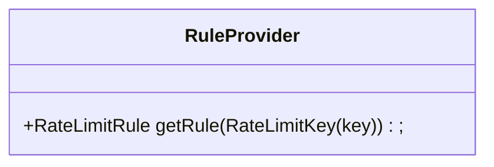
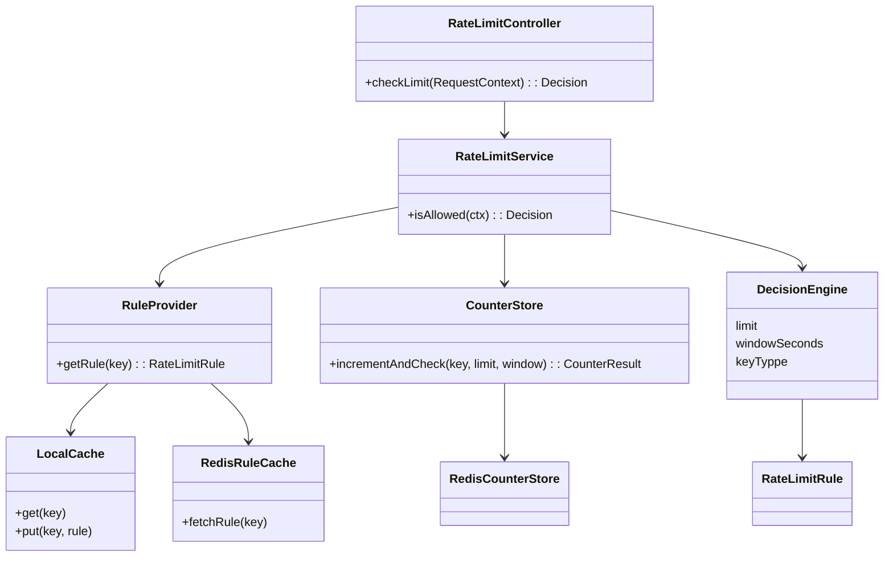

## Low level Design

1. Scope

Algorithm: Sliding Window counter(Redis Lua)
Distributed: Yes
Rules stored in B + cached
Counters stored in Redis
Faile Open if Redis is Down
Key: identifier + api

2. Identifying core responsibilities
We need to derive responsibilities from architecture:
   1.Extract Identity : Build rate limit key
   2.Fetch Rule : Config lookup
   3. Count Usage: Atomic increment
   4. Evaluate: allow/deny
   5. Return Decision: attach header

3. Define the main API(entry point)
    Decision checkLimiti(RequestContext ctx);

4. We separate logic by reason to change.
   a. Each component must have one reason to change.

   

